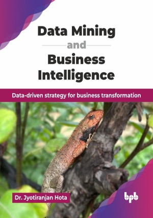

# Data Mining and Business Intelligence

Data-driven strategy for business transformation.

This is the repository for [Data Mining and Business Intelligence
](https://bpbonline.com/products/data-mining-and-business-intelligence?variant=44637368287432),published by BPB Publications.

## About the Book
Data mining is crucial in business intelligence as it enables organizations to extract valuable insights and patterns from vast datasets, ultimately supporting informed decision-making, enhancing operational efficiency, and driving strategic growth. Validations, model building and interpretations are accomplished through databases, data warehouses, various supervised and unsupervised algorithms, tools for data modeling, descriptive analytics, diagnostic analytics, predictive analytics and prescriptive analytics to ensure accurate decision-making. 

This book systematically explores the core concepts and techniques of data mining and business intelligence. It begins by introducing fundamental principles and key methodologies, including regression, classification, association rule mining, and clustering. The text progresses to cover business intelligence architectures, data warehousing, and essential practices like data modeling, dashboard design, and data visualization using tools like Power BI. Furthermore, it delves into advanced topics such as text mining, big data analytics, and the ethical considerations surrounding data mining and business intelligence, ensuring a well-rounded understanding.

Upon completing this book, readers will be competent in understanding various pre-processing techniques, applying appropriate data mining algorithms to large data sets, and conducting data analysis and interpretation to derive meaningful insights. They will also gain skills in data modeling and visualization to effectively communicate findings to business leaders and policymakers. Additionally, readers will develop an understanding of ethical considerations in data practices.

## What You Will Learn
• Conducting pre-processing of data, applying appropriate algorithm to generate model summary and communicating the result effectively.

• Master data mining, BI principles, regression, classification, association rules, and clustering.

• Design BI architectures, ETL processes, data warehouses, and effective data visualizations.

• Utilize Power BI for data modeling, dashboard design, and create compelling data visualizations.

• Explore text mining, big data analytics, and the ethical dimensions of data practices.

• Implement regression, classification, association rule mining, and clustering techniques.

• Develop expertise in data mining, business intelligence, and ethical data application.
